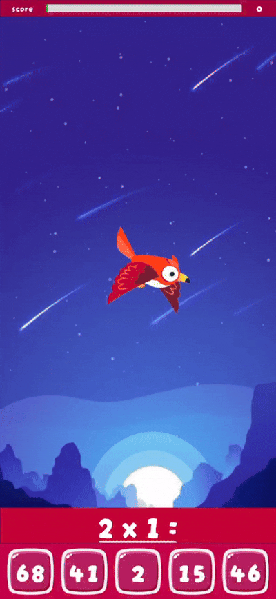

# Learn Multiplication Game

A simple mobile📱unity game where you need to keep a bird🐦 in the air by solving multiplication examples without letting it fall.

## Gallery🖼️

| Game view | Main menu | Select difficulity | Game over |
|:----------|:----------|:-------------------|:----------|
|     |   |    |   |
