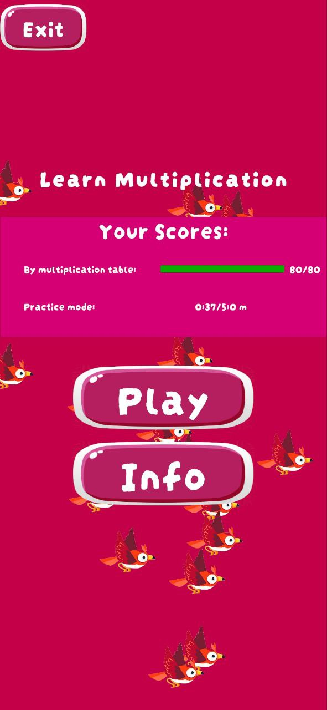
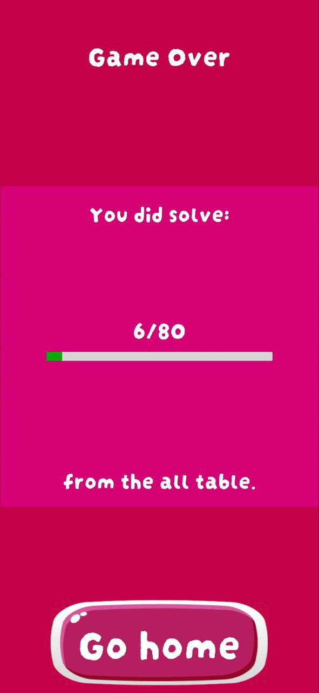
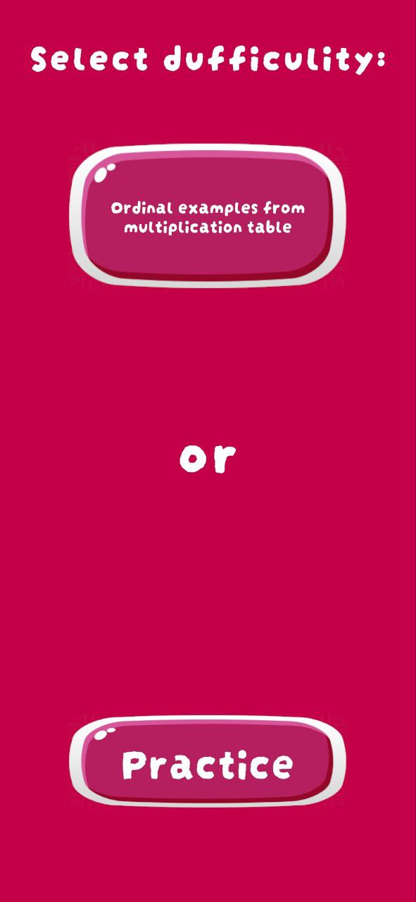

# Learn Multiplication Game

A simple mobile📱**Unity** game where you need to keep a bird🐦 in the air by solving multiplication examples without letting it fall.

## Gallery🖼️

| Game view | Main menu | Select difficulity | Game over |
|:----------|:----------|:-------------------|:----------|
|     |   |    |   |

## Game logic

Player must press the button with the correct answer to the example to keep the bird in the air. If the answer is correct, power is added to the bird and it "flies" up, but if the answer is incorrect, nothing is added to the bird, if the bird falls down, then it is a loss.

**Game has 2 difficulty levels.**

* Ordinal examples from multiplication table *(solve all examples in order from the multiplication table)*
* Practice *(hold out 5 minutes)*

## Used assets

### **UI** buttons(**Unity** asset store):

    371 Simple Buttons Pack

### Other sprites:

  -> <a href="https://www.freepik.com">freepik</a>
